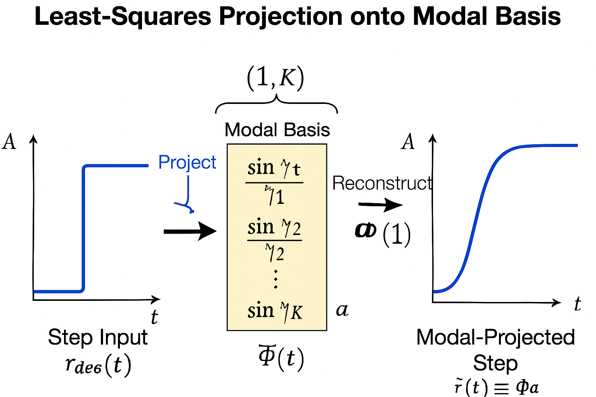

Spectrally shaped control via zeta modal projection

A simulation framework that shapes reference signals using the imaginary parts of Riemann zeta zeros, enabling smooth, bandwidth‑compatible trajectories for PID‑controlled systems. Results show improved tracking fidelity and reduced control effort compared to raw step inputs.

# zetamodalprojection
